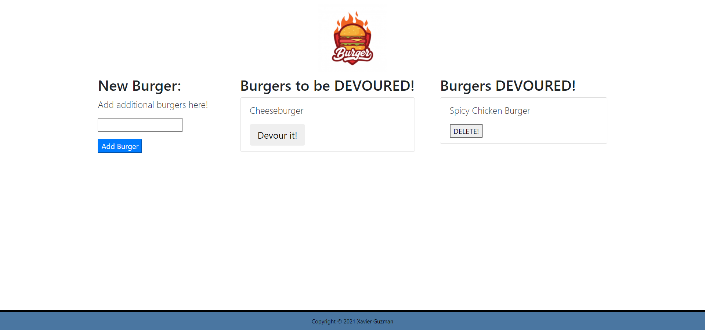

# Employee Tracker
  

  # Table of Contents:

  1. [Description](#description)
  2. [Installation Process](#installation-process)
  3. [Usage](#usage)
  4. [License](#license)
  5. [Contributors](#contributors)
  6. [Testing](#testing)
  7. [Github Username](#github-username)
  8. [Email Address](#email-address)
  9. [Examples](#examples)

## Questions:
- Contact Me:

  - If you have any questions about the application please email me at guzmanxavi112@gmail.com.
  - Here you can find my Github page [XavierG13](https://github.com/XavierG13)

## Description:

* Eat-Da-Burger! is a restaurant app that lets users input the names of burgers they'd like to eat.

* Whenever a user submits a burger's name, your app will display the burger on the left side of the page -- waiting to be devoured.

* Each burger in the waiting area also has a `Devour it!` button. When the user clicks it, the burger will move to the right side of the page.

* Your app will store every burger in a database, whether devoured or not.

## Installation Process:
npm init to initialize package.json
npm install to install dependencies
npm i mysql
npm i express
npm i express-handlebars
npm i method-override: allows use of verbs such as PUT and DELETE
npm i body-parser: parse information under the req.body property where client does not allow

## Usage:
  User's will utilize the MVC model to create, update, and delete burgers. A user is allowed to add a new burger of their choosing. Once a burger is created they will the have the ability to DEVOUR the burger. After the burger is devoured it will then be placed under a devoured section which can then be deleted by the user.

## License:
  - This application is covered under the MIT license.
  
## Contributors:
  N/A

## Testing:
  N/A

### Github Username:
  XavierG13

### Email Address:
  guzmanxavi112@gmail.com

# Examples:

## Images
- 

## Video:
- [Link to video](https://drive.google.com/file/d/1DgeQDcA6lA3JUCOvQlwHGCvYcJ6utuhH/view)

- [Link to Website](https://still-depths-05478.herokuapp.com/burgers)